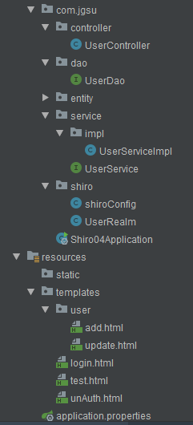

# springboot整合shiro
## 1.导入相关依赖

```
        <!--springboot与web的依赖-->
        <dependency>
            <groupId>org.springframework.boot</groupId>
            <artifactId>spring-boot-starter-web</artifactId>
        </dependency>
        <!--mysql驱动-->
        <dependency>
            <groupId>mysql</groupId>
            <artifactId>mysql-connector-java</artifactId>
            <scope>runtime</scope>
        </dependency>
        <dependency>
            <groupId>org.springframework.boot</groupId>
            <artifactId>spring-boot-starter-jdbc</artifactId>
        </dependency>
        <!--thymeleaf与springboot整合的依赖-->
        <dependency>
            <groupId>org.springframework.boot</groupId>
            <artifactId>spring-boot-starter-thymeleaf</artifactId>
        </dependency>

        <!--shiro与spring的依赖，包含了shiro-web,shiro-spring,shiro-core三个包-->
        <dependency>
            <groupId>org.apache.shiro</groupId>
            <artifactId>shiro-spring</artifactId>
            <version>1.2.2</version>
        </dependency>
        <!--druid连接池-->
        <dependency>
            <groupId>com.alibaba</groupId>
            <artifactId>druid</artifactId>
            <version>1.1.16</version>
        </dependency>
        <!--springboot整合mybatis依赖-->
        <dependency>
            <groupId>org.mybatis.spring.boot</groupId>
            <artifactId>mybatis-spring-boot-starter</artifactId>
            <version>2.0.1</version>
        </dependency>
        <dependency>
            <groupId>org.springframework.boot</groupId>
            <artifactId>spring-boot-starter-test</artifactId>
            <scope>test</scope>
        </dependency>
        <!--lombok插件,省略entity的set，get方法-->
        <dependency>
            <groupId>org.projectlombok</groupId>
            <artifactId>lombok</artifactId>
        </dependency>

        <!--thymeleaf与shiro整合的额外依赖-->
        <dependency>
            <groupId>com.github.theborakompanioni</groupId>
            <artifactId>thymeleaf-extras-shiro</artifactId>
            <version>2.0.0</version>
        </dependency>
```
## 2. 这是我搭建的完整目录结构

## 3. 首先我们先看前端页面代码

### 3.1 测试thymeleaf的界面(test.html)
注:里面包含进如add，update页面的链接，其中shiro:hasPermission="user:add"表示只有有add权限的用户才能看到该页面。

```
<!DOCTYPE html>
<html lang="en" xmlns:th="http://www.thymeleaf.org" xmlns:shiro="http://www.w3.org/1999/xhtml">
<head>
    <meta charset="UTF-8">
    <title>测试Thymeleaf</title>
</head>
<body>
<h1 th:text="${name}"></h1>
<hr/>
<!--这里的add跳转，与controller中 @RequestMapping("/add")一致，然后@RequestMapping("/add)引用return "/user/add";-->
<div shiro:hasPermission="user:add"><!--shiro:hasPermission="user:add"表示只有有add权限的用户才能看到该页面-->
    进入用户添加功能:<a href="add">添加</a><br/>
</div>
<div shiro:hasPermission="user:update">
    进入用户更新功能:<a href="update">更新</a><br/>
</div>
<a href="/toLogin">登录账户</a>
</body>
</html>
```
### 3.2 登录账户的界面(login.html)
注:name="username"不要忘记写，切记，如果忘记写，后端会接收不到登录界面输入的数据，也就不能和数据库中的数据进行比对从而不能实现用户登录。(这个错误很低级，但不好找不错误，我为了找这个是错误花了2-3个小时)。th:text="${msg}"，这是反馈信息，如果用户名或密码错误，会通过这个接口反馈


```
<!DOCTYPE html>
<html lang="en" xmlns:th="http://www.thymeleaf.org">
<head>
    <meta charset="UTF-8">
    <title>登录界面</title>
</head>
<body>
<h1 align="center">欢迎来到登录页面</h1>
<p style="color: red" th:text="${msg}"></p>
<form method="post" action="/login">
    用户名:<input type="text" placeholder="username" name="username"><br/>
    密码:<input type="password" placeholder="password" name="password"><br/>
    <input type="submit" value="登录">
</form>
</body>
</html>
```

### 3.3 add/update页面
注:这两个界面在themyleaf下的user文件夹下，所以我们写路径时要写:/user/add(update)
```
<!DOCTYPE html>
<html lang="en">
<head>
    <meta charset="UTF-8">
    <title>添加</title>
</head>
<body>
<h1>用户添加功能</h1>
</body>
</html>
```

## 4. 编写shiro/shiroConfig(UserRealm)
### 4.1 编写shiroConfig配置类
先看代码，
注:1.每个方法上都要写bean注解，类上写@Configuration注解，使其进入spring容器。
   2.@Qualifier的意思是合格者，通过这个标示，表明了哪个实现类才是我们所需要的

```
/*
 * shiro的配置类
 * */
@Configuration   //表名该类为配置类
public class shiroConfig {
    /*
     * 1.创建ShiroFilterFactoryBean
     * */
    @Bean("filterFactoryBean")
    public ShiroFilterFactoryBean getShiroFilterFactoryBean(@Qualifier(value = "securityManager") DefaultWebSecurityManager securityManager) {
        ShiroFilterFactoryBean shiroFilterFactoryBean = new ShiroFilterFactoryBean();
        //设置安全管理器(defaultWebSecurityManager)
        shiroFilterFactoryBean.setSecurityManager(securityManager);
        /*
         ****** shiro的内置过滤器****
         * anon ：无参，表示可匿名访问
         * authc ：无参，表示需要认证才能访问
         * authcBasic ：无参，表示需要httpBasic认证才能访问
         * user ：表示用户不一定需要通过认证，只要曾被 Shiro 记住过登录状态(RememberMe)就可以正常发起 /home 请求
         * perms[admin:edit]：表示用户必需已通过认证，并拥有 admin:edit 权限才可以正常发起 /edit 请求
         * roles[admin] ：表示用户必需已通过认证，并拥有 admin 角色才可以正常发起 /admin 请求
         * */
        Map<String, String> filters = new LinkedHashMap();  //顺序的Map
        filters.put("/login", "anon");
        filters.put("/testThymeleaf", "anon");//anon ：无参，表示可匿名访问(无需权限)，没有设置的表示默认无需权限访问
       // filters.put("/add", "authc");//authc,使得/add需要授权才能访问
        //授权过滤器
        //user:update为授权字符串必须与UserRealm中的 info.addStringPermission("user:update");一致
        filters.put("/update","perms[user:update]");//表示用户必需已通过认证，并拥有 user:update 权限才可以正常发起 /update 请求
        filters.put("/add","perms[user:add]");
        shiroFilterFactoryBean.setLoginUrl("/toLogin");   //设置需要授权的路径经拦截后跳转的路径
        shiroFilterFactoryBean.setUnauthorizedUrl("/unAuth");  //跳转到未授权提示页面
        shiroFilterFactoryBean.setFilterChainDefinitionMap(filters);
        return shiroFilterFactoryBean;
    }

    /*
     * 2.创建DefaultWebSecurityManager
     * SecurityManager是Shiro的心脏，所有具体的交互都通过SecurityManager进行控制，它管理着所有Subject、且负责进行认证和授权、及会话、缓存的管理。
     * */
    @Bean(name = "securityManager")
    public DefaultWebSecurityManager getDefaultWebSecurityManager(@Qualifier(value = "userRealm") UserRealm userRealm) {
        DefaultWebSecurityManager securityManager = new DefaultWebSecurityManager();
        securityManager.setRealm(userRealm);
        return securityManager;
    }

    /*
     *引入自定义的Realm
     * */
    @Bean(name = "userRealm")   //将其添加到spring容器中
    public UserRealm getUserRealm() {
        return new UserRealm();
    }

    /*
    * 配置shiroDailect模块整合thymeleaf与shiro，用以实现不同权限用户模块的查看
    * */
    @Bean
    public ShiroDialect getShiroDialect(){
        return new ShiroDialect();
    }

}
```
### 4.2 编写UserRealm自定义配置类
注: 1.需要继承AuthorizingRealm，并重写AuthorizationInfo(授权方法),AuthenticationInfo(是主体（Subject）的身份认证信息)方法
```
/*
 * 自定义一个Realm，
 * */
public class UserRealm extends AuthorizingRealm {
    /*该方法为授权作用*/
    @Override
    protected AuthorizationInfo doGetAuthorizationInfo(PrincipalCollection principalCollection) {
        System.out.println("该方法为授权作用");
        //给资源进行授权
        SimpleAuthorizationInfo info = new SimpleAuthorizationInfo();
        //添加授权资源的字符串(此方法不灵活，不能直接从数据库中获取权限)
        //info.addStringPermission("user:update");
        //1.先获取用户
        Subject subject = SecurityUtils.getSubject();
        //获取的是User用户的值:User(uid=1, username=aaa, password=123, perms=user:add)
        User user = (User) subject.getPrincipal();
        //System.out.println("getPrincipal的值为:" + subject.getPrincipal());
        User id = userService.findById(user.getUid());
        info.addStringPermission(id.getPerms());
        return info;
    }

    @Autowired
    private UserService userService;

    /*该方法为认证作用*/
    @Override
    protected AuthenticationInfo doGetAuthenticationInfo(AuthenticationToken authenticationToken) throws AuthenticationException {
        System.out.println("该方法为认证作用");
        UsernamePasswordToken token = (UsernamePasswordToken) authenticationToken;
        User user = userService.findByUserName(token.getUsername());
        if (user == null) {//如果用户名存在，则报错
            return null;
        }
        //第一个取值(user)为principal的值，对应上面的subject.getPrincipal();
        return new SimpleAuthenticationInfo(user, user.getPassword(), "");
    }
}

```
## 5. entity层User.class
注:@Data是lombok的一个注解，他对set/get方法进行封装了
```
@Data
public class User {
    private Integer uid;
    private String username;
    private String password;
    private String perms;   //用户权限字段
}
```

## 6.dao层UserDao.class(主要应用mybatis框架)
```
@Repository   
public interface UserDao {
    @Select("select * from user where username = #{username}")
     User findByUserName(String username);
    //根据uid查数据
    @Select("select * from user where uid = #{uid}")
    User findById(Integer uid);
}

```

## 7. service层(主要应用spring框架)
### 7.1 UserService.class

```
public interface UserService {
    User findByUserName(String username);
    User findById(Integer uid);
}

```

### 7.2 UserServiceImpl.class
注:@Service要加在类上， @Autowired 注入UserDao接口，然后实现UserDao的方法;
```
@Service
public class UserServiceImpl implements UserService {
    @Autowired
    private UserDao userDao;
    @Override
    public User findByUserName(String username) {
        return userDao.findByUserName(username);
    }

    @Override
    public User findById(Integer uid) {
        return userDao.findById(uid);
    }
}
```

## 8.controller层UserController.class(主要用到springmvc框架)
注:这里面主要负责后端与前端页面交互的过程，详情请看代码
```
@Controller
public class UserController {
    @Autowired
    UserService userService;
    /*
    * 测试Thymeleaf的功能
    * */
    @RequestMapping("/testThymeleaf")
    public String testThymeleaf(Model model){
       //将数据存入到model中
        model.addAttribute("name","hello Thymeleaf");
        //将存入的数据，返回至test.html显示
        return "test";

    }
    /*
    * add.html页面的跳转
    * */
    @RequestMapping("/add")
        public String add(){
        //返回的路径为:thymeleaf(默认加载)下的user下面的add.html
        System.out.println("add");
            return "/user/add";
        }

    /*
     * add.html页面的跳转
     * */
    @RequestMapping("/update")
    public String update() {
        //返回的路径为:thymeleaf(默认加载)下的user下面的update.html
        return "/user/update";
    }

    /*
        * login.html页面的跳转
        * */
    @RequestMapping("/toLogin")
    public String toLogin() {
        //返回的路径为:thymeleaf(默认加载)下的login.html
        System.out.println("toLogin");
        return "/login";
    }
    @RequestMapping("/unAuth")  //表示未被授权页面的路径
        public String unAuth() {
            //返回的路径为:thymeleaf(默认加载)下的login.html
            System.out.println("unAuth");
            return "/unAuth";
        }

/*
* 登录认证逻辑
* */
    @RequestMapping("/login")
    public String login(String username, String password,Model model) {
        System.out.println("login");
        System.out.println("username:"+username);
        System.out.println("password:"+password);
         //使用shiro进行登录验证
        //1.获取subject
        Subject subject = SecurityUtils.getSubject();
        //2.封装用户数据
        UsernamePasswordToken token = new UsernamePasswordToken(username, password);
        try {
            //3.执行登录方法
            subject.login(token);
            return "redirect:/testThymeleaf";   //登录成功则重定向到/testThymeleaf页面
        } catch (UnknownAccountException e) {   //用户名错误
            //e.printStackTrace();
            model.addAttribute("msg", "用户名错误");
            return "login";
        } catch (IncorrectCredentialsException e) {  //密码错误
            //e.printStackTrace();
            model.addAttribute("msg", "密码错误");
            return "login";
        }

    }
}

```

## 结语
以上就是我对springboot整合shiro的理解，可能有点太冗余，也可能哪些不规范，如果需要修正的可以给我留言，我会采纳，同时这个会对大家有收获。<br/><br/><br/>


### <p align="right" >座右铭:</p>
<p align="right" style="color:red">日积月累才能拥有真本领，多思考，多实践 </p>

### <p align="right">源码地址:https://github.com/zuojunZzz/springboot_shhiro </p>

### <p align="right">作者:zuojunZzz</p>


